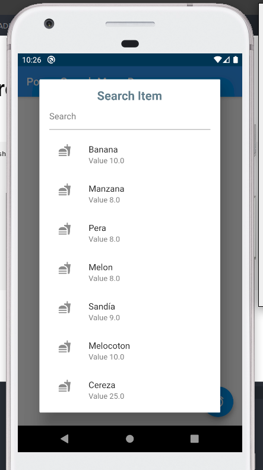
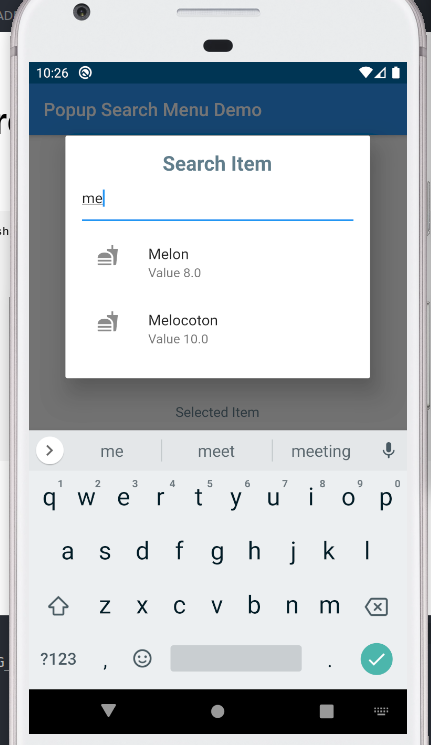

# Search Popup Dialog

Usage 
```
        showDialog(
                context: context,
                builder: (context) {
                  return MyDialog(
                    onValuePicked: (value) {
                      setState(() {
                        selectedItem = value;
                      });
                    },
                  );
                });

```

Preview

Popup Dialog |Filtered Dialog
:-----------:|-----------------:
 | 

